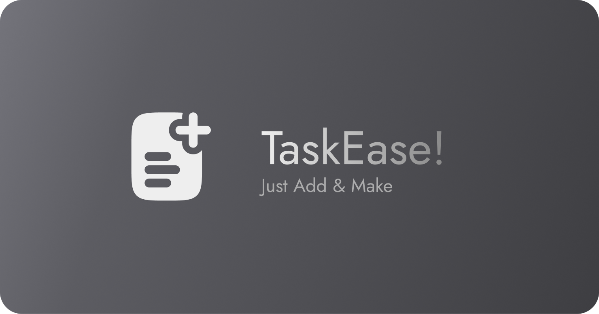

    

version 1.1.0

###

---

###

### 🧠 What is TaskEase?

This project was created with inspiration from [João Victor](https://github.com/joaovictornsv) project for those who need to organize their tasks in a simple and manageable way.

The application doesn't have thousands of features, it has just enough to help you remember your tasks with a friendly user interface.

---

###

### 💡 How use

You can add your tasks. You can also edit and remove your tasks.

###

---

### 🚀 Technologies

[Angular 18](https://angular.dev/), [SCSS](https://sass-lang.com/) and [TypeScript](https://www.typescriptlang.org/)

---

### 🌱 Initial Project

Take a closer look at the original project: [LocalList](https://github.com/joaovictornsv/local-list)

---

### 🐛 New Features

- [ x ] set task
- [ x ] sort in ascending and descending order
- [ x ] light and dark theme
- [ ] include categories for tasks (with colors, perhaps)
- [ ] include sections for tasks
- [ ] encrypt and decrypt note data

###

---

### ⚖️ License

[MIT License](https://github.com/aliciamendes/todo-list/blob/main/LICENSE)

---

###

    Created by <a href="https://github.com/aliciamendes">Alícia Mendes </a>
    with inspiration from <a href="https://github.com/joaovictornsv">João Victor </a> 🚀
    

