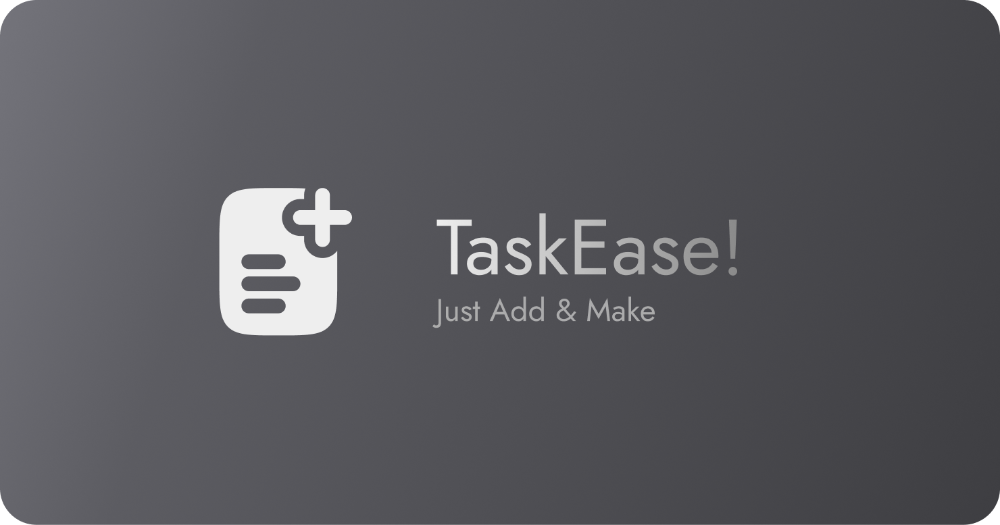

    

---

### 🧠 What is LocalList?

This project was created with inspiration from [João Victor](https://github.com/joaovictornsv) LocalList project for those who need to organize their tasks in a simple and manageable way.
The application doesn't have thousands of features, it has just enough to help you remember your tasks with a friendly user interface.

---

### 💡 How use

You can add your tasks and organize them. You can also edit, remove and pin your tasks.

---

### 🚀 Technologies

- [Angular](https://angular.dev/)

---

### 🎁 Contributing

Pull requests are welcome. For major changes, please open an issue first to discuss what you would like to change.

---

### ⚖️ License

[MIT License](https://github.com/aliciamendes/todo-list/blob/main/LICENSE)

---

### 🌱 Initial Project

[LocalList](https://github.com/joaovictornsv/local-list)

---

    Created by <a href="https://github.com/aliciamendes">Alícia Mendes </a>🚀
    

